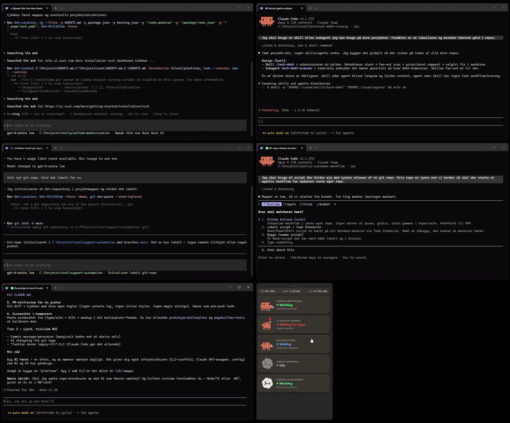

# AI Session Widget

A small always-on-top Windows widget that shows every Claude Code and Codex
session running on your machine — what each one is doing, and which ones are
sitting there waiting for you.



If you keep three or four agent sessions going at once across different
terminal windows, the annoying part isn't the work — it's noticing that one of
them finished two minutes ago, or is blocked on a permission prompt you never
saw. This sits in the corner and answers that at a glance.

Click a session and it brings that session's terminal window to the front,
with a brief highlight so you can spot it among a dozen open windows.

## Features

- **Live status per session** — Working, Waiting for input, Idle, or finished
  with a question, colour-coded and with an animated mascot per state.
- **What it's actually doing** — "Reading main.rs", "Running a command",
  "Needs permission: Bash", "Asked a question".
- **Click to focus** — brings the owning terminal window forward and flashes a
  highlight frame around it. Works even when several sessions share one
  process (e.g. multiple Windows Terminal tabs).
- **Resource usage** — CPU, RAM and disk I/O for your sessions, next to the
  machine total, so you can see what the agents are costing you.
- **Orphaned-process warning** — flags tool processes (a runaway `find`, a
  stray `node`) left behind by a session whose parent shell already exited.
- **Light/dark/system theme**, auto-sizing or manually resizable, always-on-top
  toggle — all from the right-click menu.

## Requirements

**Windows only.** The window-focusing, highlight overlay and Codex lock
detection are built on Win32 APIs (UI Automation, DWM, Restart Manager) with no
cross-platform equivalent here. It will not build on macOS or Linux.

You also need [Claude Code](https://claude.com/claude-code) and/or
[Codex](https://developers.openai.com/codex) installed — the widget just reads
what they already write to disk.

## Install

Grab the installer from the [latest release](../../releases/latest) — either
the `.msi` or the `-setup.exe`. That's it; there's nothing to configure.

### Build it yourself

Needs [Rust](https://rustup.rs/), [Node.js](https://nodejs.org/) 20+, the MSVC
build tools, and the WebView2 runtime (preinstalled on Windows 11).

```bash
npm install
npm run tauri dev     # run it
npm run tauri build   # produce installers in src-tauri/target/release/bundle/
```

## How it works

Both agents already keep a record of their running sessions on disk. The widget
polls those every two seconds, read-only:

| | Claude Code | Codex |
|---|---|---|
| Which sessions are live | `~/.claude/sessions/<pid>.json` | held `~/.codex/thread-writer-locks/<id>.lock` |
| What it's doing | tail of `~/.claude/projects/<dir>/<sessionId>.jsonl` | `~/.codex/sessions/YYYY/MM/DD/rollout-*.jsonl` |

**No hooks, config changes, API keys or wrappers are required.** The widget
never writes to those directories, never talks to any network service, and
never kills a process — including the orphans it warns you about. It only
reads, and calls Win32 to move a window to the foreground.

See [docs/codex-sessions.md](docs/codex-sessions.md) for the Codex specifics.

### The honest caveat

Neither of these formats is a documented, stable public API — they're internal
files that happen to be readable. A Claude Code or Codex update can change them
and quietly break status detection. The adapter is written defensively
(malformed lines are skipped, missing files degrade to "no activity" rather
than crashing), but if a release breaks something, please open an issue.

Verified against Claude Code 2.1.x and Codex 0.154.0.

## Tech

Tauri 2, a Rust backend, and a vanilla TypeScript + CSS frontend — no UI
framework. The mascot is hand-built SVG.

## Contributing

Issues and PRs welcome. `cargo test --manifest-path src-tauri/Cargo.toml` and
`npx tsc --noEmit` both run in CI and should stay green.

## License

MIT — see [LICENSE](LICENSE).

Not affiliated with, endorsed by, or sponsored by Anthropic or OpenAI. "Claude"
and "Codex" are the trademarks of their respective owners. The Codex mark is
from [lobe-icons](https://github.com/lobehub/lobe-icons) (see
[codex.LICENSE](src/mascot-svgs/codex.LICENSE)).
